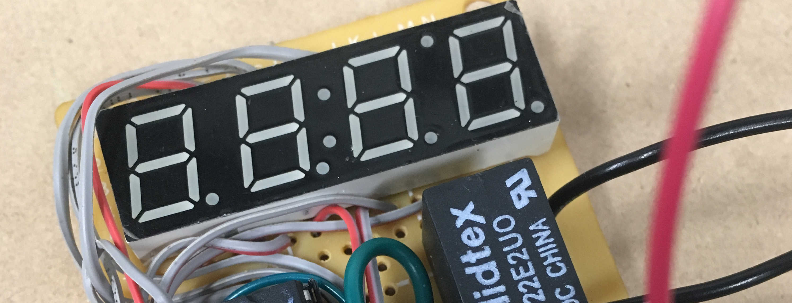
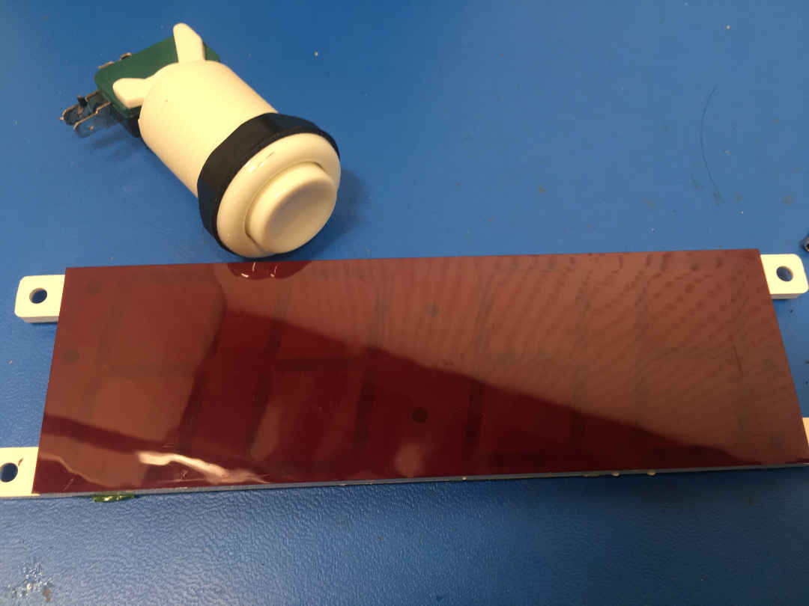

# Seven-Segment LED Display
Example code for driving a 4 digit 7 segment display with a minimum of components

---


## Included functions

* **initialize display I/O**

```c
void initIO(void)
```
* **set the display to a short string of text**

```c
void text(char input[4])
```

* **run the display (using a a loop or interrupt)** 

```c
void updateDisplay(uint8_t brightness) 
```

---

### TODO

* upload finalized schematic
* seperate the display function library from the other functional elements
* provide an example of use
<!--* **_supersize it_**

<!---->

